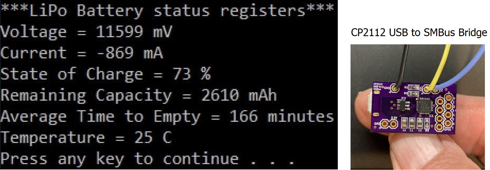

This code was forked from Nick Dademo's repo and modified to show more battery registers.

If using the CP2112 circuit board shown above and described in step 15 of: https://www.instructables.com/Battery-Powered-Raspberry-Pi-in-Repurposed-Laptop/ 
* Wire the clock, data, and ground from the board to the cooresponding laptop battery connector pins. 
* The board will pull up the clock and data to 3.3 volts.
* Connect a USB cable from a Windows 10 PC to the board. 

If using the Silicon Laps CP2112EK evaluation kit:
* Ensure SDA and SCL lines are pulled-up to a voltage which is compatible with that of the target battery interface.
* Setting J7=VIO pulls up the bus to 3.3V - this should be compatible with the majority of applications.
* If you require a different bus voltage - Set J7=EXT_PU and connect TB1(EXT_PU) to the battery interface voltage.

**Program Output will be the text window shown above:**  

**Tools/Environment:**  
- Silicon Labs CP2112EK: http://www.silabs.com/products/interface/Pages/CP2112EK.aspx or build the CP2112 circuit board shown in step 15 of: https://www.instructables.com/Battery-Powered-Raspberry-Pi-in-Repurposed-Laptop/
- Texas Instruments bq20z65-R1 Gas Gauge: http://www.ti.com/product/bq20z65-r1 or similar Battery Management Chip within the laptop battery.
- Windows 10 64-bit  
- Visual Studio 2019 is only needed if you want to modify the C code. 
- If no mod's are needed, run the cp2112_demo.exe from a folder that also contains the two .dll files found at this repo.
